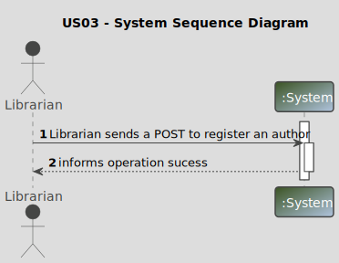
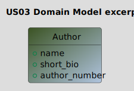
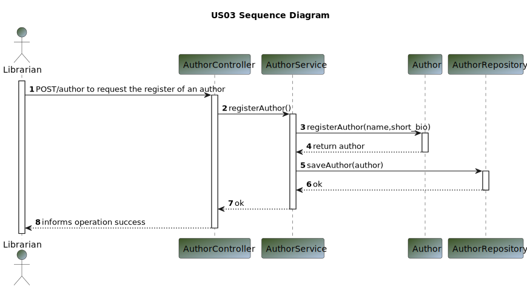

# US 03 - As Librarian I want to register an author (name, short bio)

## 1. Requirements Engineering

>In this section, it is suggested to capture the User Story description and the requirements specification as provided by the client, as well as any further clarifications on it. It is also suggested to capture the client acceptance criteria and existing dependencies to other requirements. Finally, identify the involved input and output data and depict an Actor-System interaction in order to fulfill the requirements.

### 1.1. User Story Description

>As Librarian I want to register an author (name, short bio)

### 1.2. Customer Specifications and Clarifications

**From the specifications document:**

> By simplicity, a librarian wants to register an author and give to him the name and a short bio.

**From the client clarifications:**

Question:
>1.I would like to know if when the librarian creates the author's bio, does it only consist of text or does it have another field?
I take the opportunity and ask about the author's number, if this is just a number and how is it formed?
>2.How brief should the biography be? Is there a character limit?
>3.Good afternoon, what are the us03 acceptance criteria?
>4.Good afternoon. Can there be repeated names between authors?
> 5.Good afternoon, is it mandatory to fill in the author's characteristics (name, short_bio)? Or just one of them?
What is the minimum and maximum characters for an author's name?

Answer:
>1.Good morning, the brief author biography must allow HTML content
the author number is a sequential number generated by the system
>2.Maximum 4096 characters 
>3. Good morning, By entering all mandatory data in the correct format, the author must be registered in the system. 
When entering any data in the incorrect format or not entering mandatory data, an error must be indicated. Only users 
with librarian permissions can run this option
>4. Good morning. Yes
>5.Good morning, they are both mandatory an author name has a maximum of 150 characters

### 1.3. Acceptance Criteria

**Ac03-01:** The short bio must allow content HTML.
**Ac03-02:** The author number is a sequential number generated by the system.
**Ac03-03:** The short bio must have a maximum of 4096 characters.
**Ac03-04:** By entering all mandatory data in the correct format, the author must be registered in the system.
**Ac03-05:** When entering any data in the incorrect format or not entering mandatory data, an error must be indicated.
**Ac03-06:** Only users with librarian permissions can run this option.

### 1.4. Found out Dependencies

>The library must have at least one librarian to register an author.

### 1.5 Input and Output Data

**Input Data:**

* Typed data:
    * name
    * short_bio
* Selected data:
    * n/a

**Output Data:**

* (In)success of the operation

### 1.6. System Sequence Diagram (SSD)

### 1.7 Other Relevant Remarks

* The created author is ready to be used.

## 2. OO Analysis

### 2.1. Relevant Domain Model Excerpt

_In this section, it is suggested to present an excerpt of the Domain Model (DM) that is seen as relevant to fulfill the requirements._

### 2.2. Other Remarks

_n/a_

## 3. Design - User Story Realization

### 3.1. Sequence Diagram (SD)

### 3.2. Class Diagram (CD)

## 4. Tests

_n/a_

## 5. Observations

_n/a_

