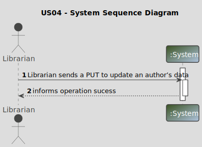
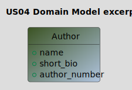
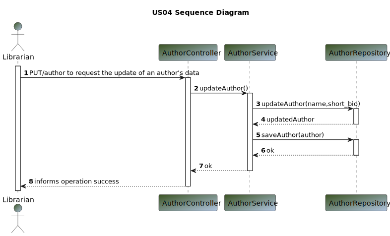
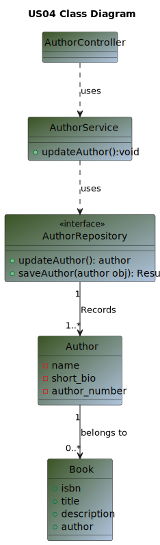

# US 04 - As Librarian I want to update an author’s data

## 1. Requirements Engineering

>In this section, it is suggested to capture the User Story description and the requirements specification as provided by the client, as well as any further clarifications on it. It is also suggested to capture the client acceptance criteria and existing dependencies to other requirements. Finally, identify the involved input and output data and depict an Actor-System interaction in order to fulfill the requirements.

### 1.1. User Story Description

>As Librarian I want to update an author’s data

### 1.2. Customer Specifications and Clarifications

**From the specifications document:**

> By simplicity, a librarian wants to update an author´s data

**From the client clarifications:**

Question:
>1.Good afternoon, What author information can the librarian change?
>2.Good afternoon, what are the us04 acceptance criteria?
>3."As Librarian I want to update an author’s data "What type of data can be changed? Just the "short bio"?

Answer:
>1.Good afternoon, with the exception of the "author number" you can change any information
>2. Good morning. They can change any author data except the author number. 
The data entered must respect the correct format. It must be possible to “clear” optional data
>3. https://moodle.isep.ipp.pt/mod/forum/discuss.php?d=28948#p36577

### 1.3. Acceptance Criteria

**Ac04-01:** The Library must have a book, in order to have an author
**Ac04-02:** The librarian can change any author data except the author number.
**Ac04-03:** The data entered must respect the correct format.
**Ac04-04:** It must be possible to “clear” optional data.

### 1.4. Found out Dependencies

>The library must have at least one book

### 1.5 Input and Output Data

**Input Data:**

* Typed data:
    * name
    * short_bio 
* Selected data:
    * author_number

**Output Data:**

* (In)success of the operation

### 1.6. System Sequence Diagram (SSD)

### 1.7 Other Relevant Remarks

* The updated author is ready to be used.

## 2. OO Analysis

### 2.1. Relevant Domain Model Excerpt

_In this section, it is suggested to present an excerpt of the Domain Model (DM) that is seen as relevant to fulfill the requirements._

### 2.2. Other Remarks

_n/a_

## 3. Design - User Story Realization

### 3.1. Sequence Diagram (SD)

### 3.2. Class Diagram (CD)

## 4. Tests

_n/a_

## 5. Observations

_n/a_
