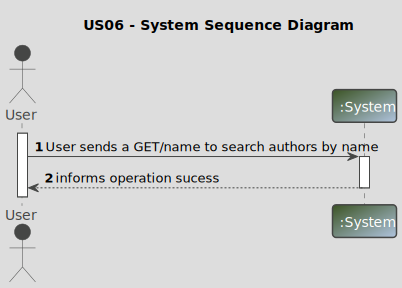
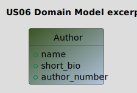
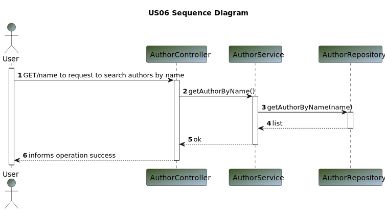
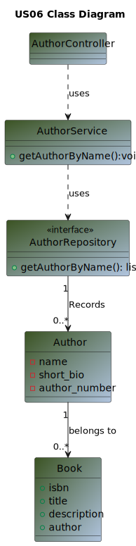

# US 06 - As Librarian or Reader I want to search authors by name

## 1. Requirements Engineering

>In this section, it is suggested to capture the User Story description and the requirements specification as provided by the client, as well as any further clarifications on it. It is also suggested to capture the client acceptance criteria and existing dependencies to other requirements. Finally, identify the involved input and output data and depict an Actor-System interaction in order to fulfill the requirements.

### 1.1. User Story Description

>As Librarian or Reader I want to search authors by name

### 1.2. Customer Specifications and Clarifications

**From the specifications document:**

> By simplicity, an user (Reader or Librarian) wants to search authors by name

**From the client clarifications:**

Question:
>1. Good afternoon, what are the us06 acceptance criteria?

Answer:
>1. Good morning. The user enters some characters and the system returns a list of all authors whose name begins with the letters entered.

### 1.3. Acceptance Criteria

**Ac05-01:** There must have at least 1 author
**Ac05-02:** There must have at least 1 book in order to have an author
**Ac05-03:** The user enters some characters and the system returns a list of all authors whose name begins with the letters entered.

### 1.4. Found out Dependencies

>The library must have at least one author and one book.

### 1.5 Input and Output Data

**Input Data:**

* Typed data:
    * n/a
* Selected data:
    * name

**Output Data:**

* (In)success of the operation

### 1.6. System Sequence Diagram (SSD)

### 1.7 Other Relevant Remarks

* The updated author is ready to be used.

## 2. OO Analysis

### 2.1. Relevant Domain Model Excerpt

_In this section, it is suggested to present an excerpt of the Domain Model (DM) that is seen as relevant to fulfill the requirements._

### 2.2. Other Remarks

_n/a_

## 3. Design - User Story Realization

### 3.1. Sequence Diagram (SD)

### 3.2. Class Diagram (CD)

## 4. Tests

_n/a_

## 5. Observations

_n/a_
