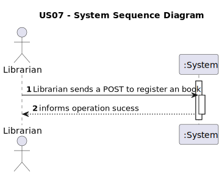
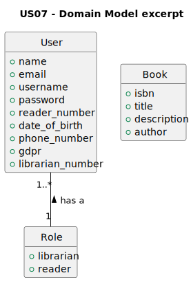
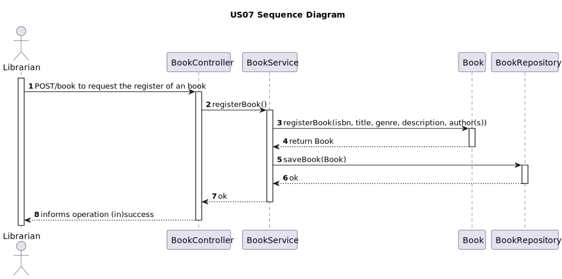
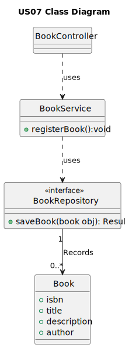

# 1. Requirements Engineering

## 1.1. User Story Description
    As Librarian, I want to register a book.

## 1.2. Customer Specifications and Clarifications

**Question**

    Good evening, what are the acceptance criteria for US07?
**Answer**

    If attempting to register a book with an existing ISBN, an error should be indicated.
    We use the ISBN-10 or ISBN-13 format.
    The book title is mandatory and cannot begin or end with spaces.
    Description is optional and must support HTML content.
    Genre and author are mandatory

## 1.3. Acceptance Criteria
* If attempting to register a book with an existing ISBN, an error should be indicated.
* We use the ISBN-10 or ISBN-13 format.
* The book title is mandatory and cannot begin or end with spaces.
* Description is optional and must support HTML content.
* Genre and author are mandatory.

## 1.4. Found out Dependencies
    The library must have at least one librarian to register an book.
## 1.5 Input and Output Data
    Input data
        Isbn, title, genre, description, author(s)
    Output data
        (In)Sucess of the operation
## 1.6. System Sequence Diagram (SSD)

## 1.7. Functionality
    The functionality of this user story is to allow the librarian to register a book.
## 1.8 Other Relevant Remarks
    n/a
# 2. OO Analysis
## 2.1. Relevant Domain Model Excerpt

## 2.2. Other Remarks
    n/a

# 3. Design
## 3.1. Sequence Diagram (SD)

## 3.2. Class Diagram (CD)

# 4. Tests 
    n/a
# 5. Observations
    n/a

