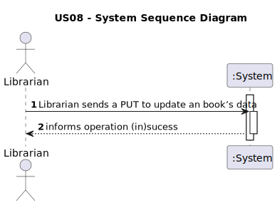
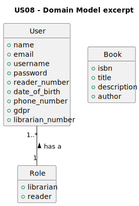
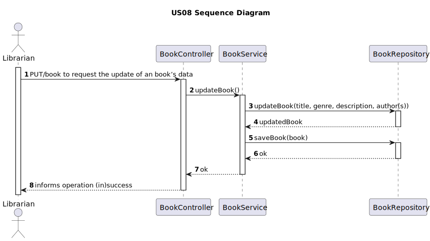
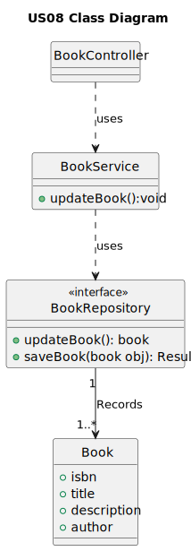

# 1. Requirements Engineering

## 1.1. User Story Description
    As Librarian I want to update a book’s data.
## 1.2. Customer Specifications and Clarifications

**Questions**

    1- Good evening, what data do we need to enter to update a book's data?
    2- Good afternoon, what are the acceptance criteria for US08?
**Answer**

    1- good morning, Apart from the ISBN, all data is changeable
    2- Good morning. You can change all the data in the book except the isbn.
    It must be possible to “clean” non-mandatory data

## 1.3. Acceptance Criteria

* You can change all the data in the book except the isbn.
* It must be possible to “clean” non-mandatory data

## 1.4. Found out Dependencies
    The library must have at least one book to update book data
## 1.5 Input and Output Data
    Input data
        - Typed data:
            title, genre, description, author(s)
        -Selected data:
            ISBN
    Output data
        (In)Sucess of the operation
## 1.6. System Sequence Diagram (SSD)

## 1.7. Functionality
    The functionality of this user story is to allow the librarian to update a book.
## 1.8 Other Relevant Remarks
    n/a
# 2. OO Analysis
## 2.1. Relevant Domain Model Excerpt

## 2.2. Other Remarks
    n/a

# 3. Design
## 3.1. Sequence Diagram (SD)

## 3.2. Class Diagram (CD)

# 4. Tests
    n/a
# 5. Observations
    n/a

