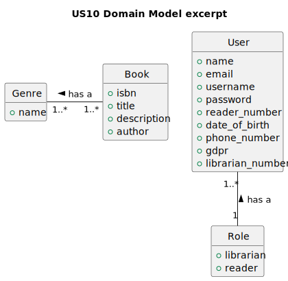
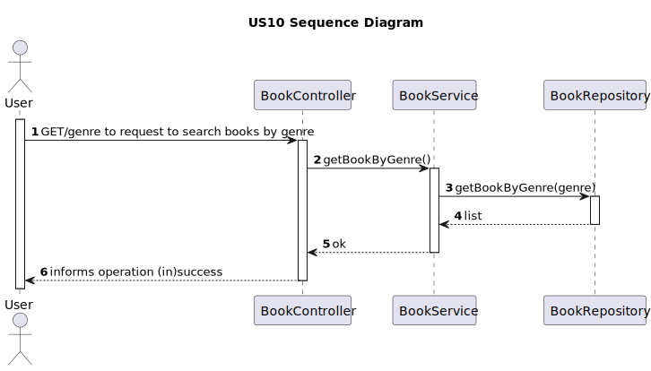

# 1. Requirements Engineering

## 1.1. User Story Description
    As Librarian or Reader I want to search books by genre

## 1.2. Customer Specifications and Clarifications

**Question**

    Good afternoon, what are the acceptance criteria for us09(As Librarian or Reader I want to know the details of a book given its ISBN) and us10(. As Librarian or Reader I want to search books by genre)?
**Answer**

    good afternoon,
    what are the acceptance criteria for us09(As Librarian or Reader I want to know the details of a book given its ISBN)
    and us10(. As Librarian or Reader I want to search books by genre)?
    All books of the indicated genre must be shown. the search must be non-exact, for example, if you search for "fi", books in the "fiction" and "finance" genres must be returned.

## 1.3. Acceptance Criteria

    All books of the indicated genre must be shown. the search must be non-exact, for example, if you search for "fi", books in the "fiction" and "finance" genres must be returned.

## 1.4. Found out Dependencies

    The library must have at least one book.

## 1.5 Input and Output Data
    Input data
        - Typed data:
            genre
        -Selected data:
            n/a
    Output data
        (In)Sucess of the operation
## 1.6. System Sequence Diagram (SSD)

## 1.7. Functionality
    The functionality of this user story is to allow the librarian or reader to search books by genre
## 1.8 Other Relevant Remarks
    n/a
# 2. OO Analysis
## 2.1. Relevant Domain Model Excerpt

## 2.2. Other Remarks
    n/a

# 3. Design
## 3.1. Sequence Diagram (SD)

## 3.2. Class Diagram (CD)

# 4. Tests
    n/a
# 5. Observations
    n/a

