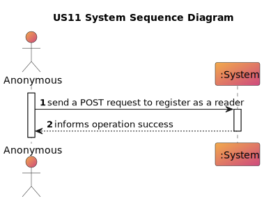
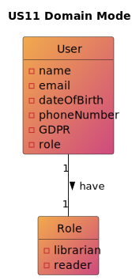
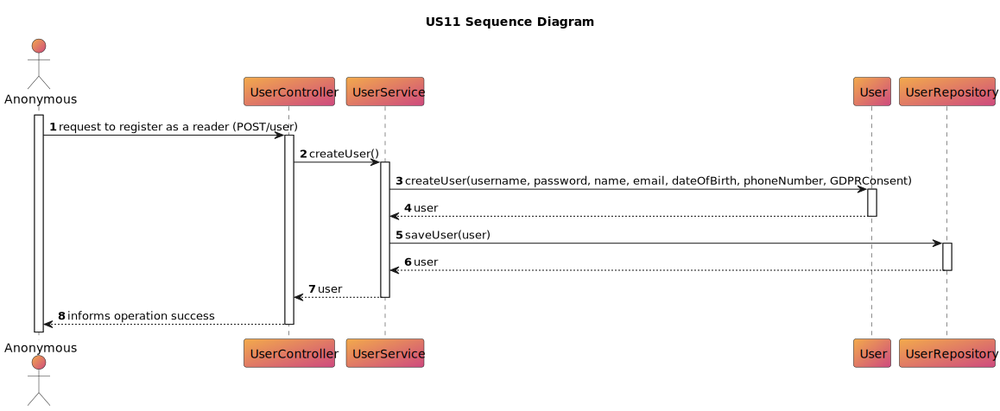
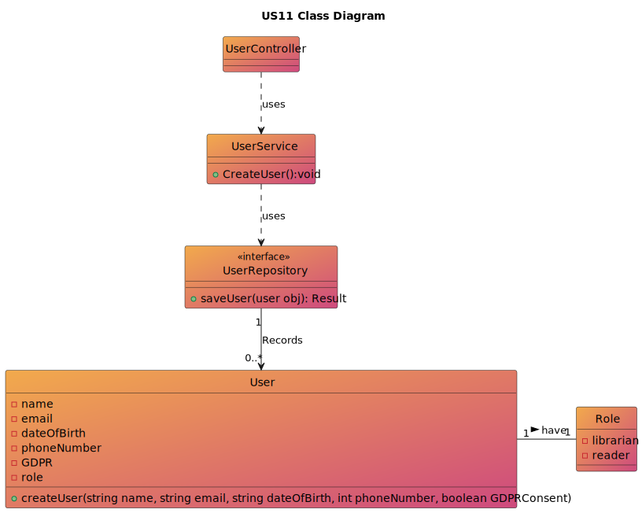

# US 11 - As anonymous I want to register as a reader.
## 1. Requirements Engineering

### 1.1. User Story Description

>As anonymous I want to register as a reader (name, email, date of birth, phone number, GDPR
consent). A Reader Number is assigned to me by the library.

### 1.2. Customer Specifications and Clarifications

**From the specifications document:**

> By simplicity, a reader has a name, an email, a date of birth, a phone number, a GDPR consent and a reader number.

**From the client clarifications:**

**Question:**
>gostaria são as caracteristicas que descreve uma pessoa anonymous?

**Answer:**
>um utilizador anónimo é um utilizador que desconhecemos e não é importante saber nada nada sobre ele.
para o requisito "11. As anonymous I want to register as a reader" de notar que este anónimo se quer registar como leitor e como tal irá indicar as caracteristicas necessárias e deixar de ser anónimo no fim do registo.

### 1.3. Acceptance Criteria

**AC11-01:** A reader can't have more than one email.
**AC11-02:** A reader has to have atleast 12 years old.
**AC11-03:** The phone number has to be portuguese.
**AC11-04:** The reader number is formed by the year of the register and a sequential number.

### 1.4. Found out Dependencies
* No dependencies were found

### 1.5 Input and Output Data

**Input Data:**

* Typed data:
    * username
    * password
    * name
    * email
    * dateOfBirth
    * phoneNumber
    * GDPRConsent
* Selected data:
    * n/a

**Output Data:**

* (In)success of the operation

### 1.6. System Sequence Diagram (SSD)

### 1.7 Other Relevant Remarks
* n/a
## 2. OO Analysis
* n/a
### 2.1. Relevant Domain Model Excerpt

### 2.2. Other Remarks

* n/a

## 3. Design - User Story Realization

### 3.1. Sequence Diagram (SD)

### 3.2. Class Diagram (CD)

## 4. Tests

* n/a

## 5. Observations
* n/a

