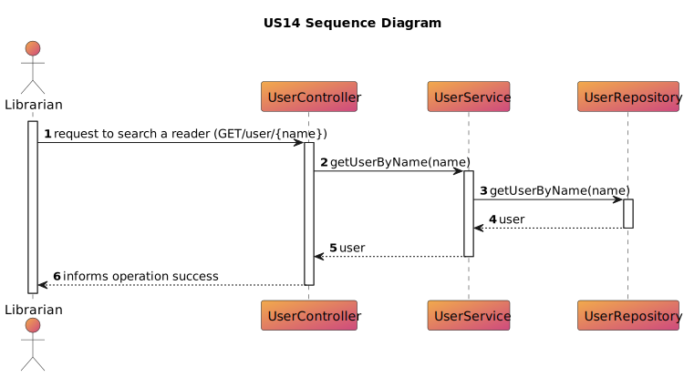

# US 14 - As Librarian I want to search Readers by name.

## 1. Requirements Engineering

### 1.1. User Story Description

>As Librarian, I want to search Readers by name.

### 1.2. Customer Specifications and Clarifications

**From the specifications document:**

> By simplicity, a librarian can search up a reader by his name.

**From the client clarifications:**

**Question:**
>* n/a

**Answer:**
>* n/a

### 1.3. Acceptance Criteria

**AC12-01:** As Librarian, I want to search Readers by name.

### 1.4. Found out Dependencies
* No dependencies were found

### 1.5 Input and Output Data

**Input Data:**

* Typed data:
    * name

* Selected data:
    * n/a

**Output Data:**

* (In)success of the operation

### 1.6. System Sequence Diagram (SSD)

### 1.7 Other Relevant Remarks
* n/a
## 2. OO Analysis
* n/a
### 2.1. Relevant Domain Model Excerpt

### 2.2. Other Remarks

* n/a

## 3. Design - User Story Realization

### 3.1. Sequence Diagram (SD)

### 3.2. Class Diagram (CD)

## 4. Tests

* n/a

## 5. Observations
* n/a

