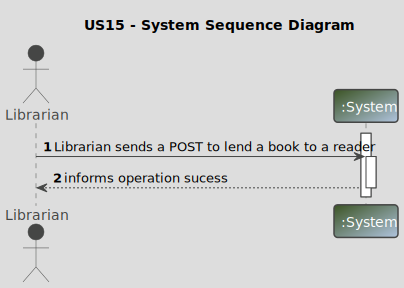
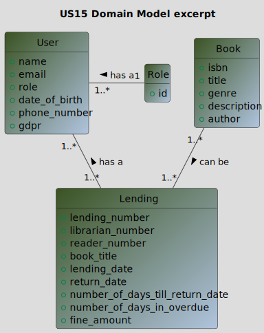
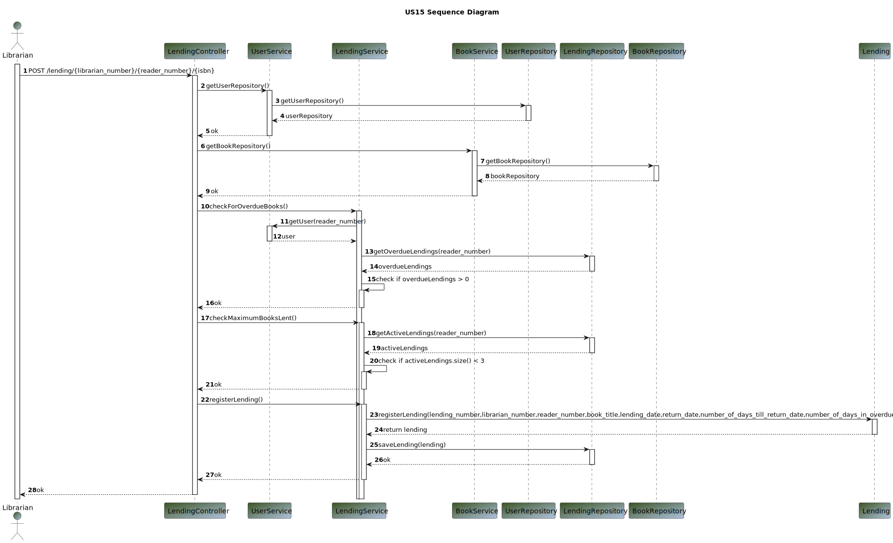
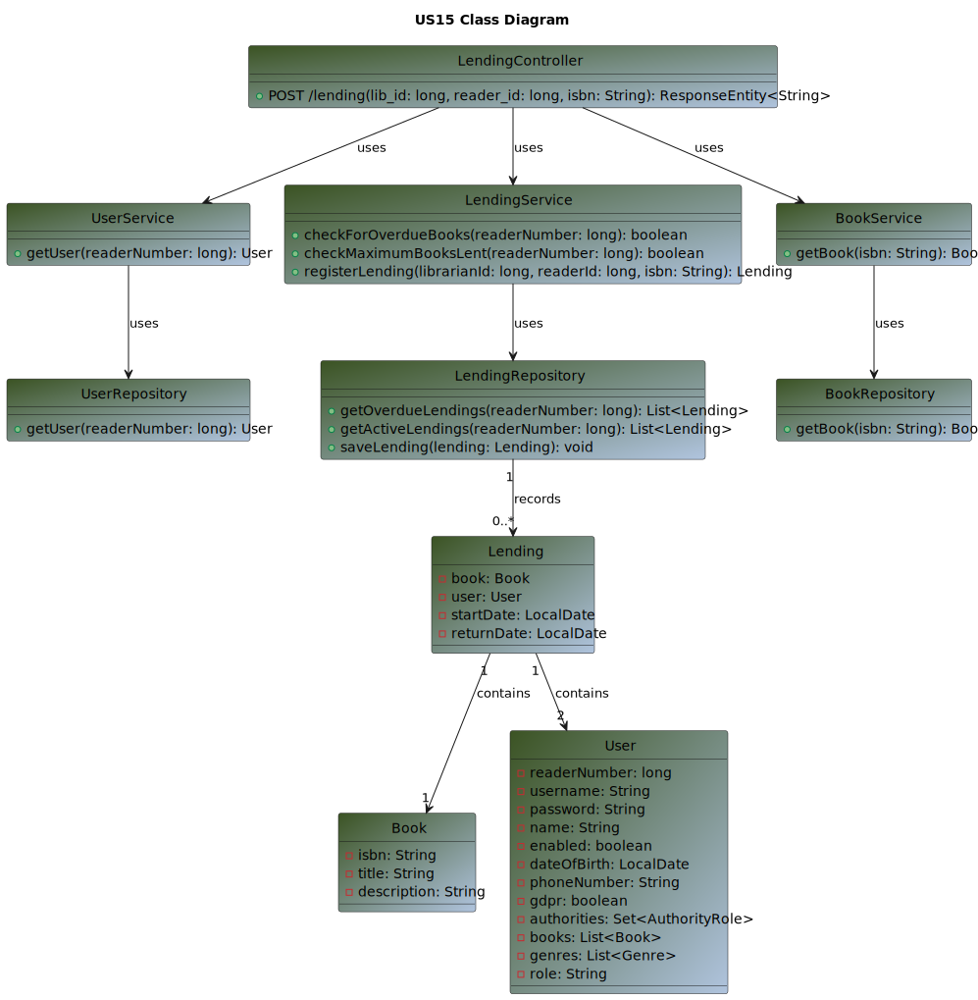

# US 15 - As Librarian I want to lend a book to a reader. The lending can only be done if the reader has no
# overdue books and the reader can have at most 3 books lent. The return date must be presented
# to the Librarian

## 1. Requirements Engineering

### 1.1. User Story Description

>As a Librarian I want to lend a book to a reader. The lending can only be done if the reader has no
overdue books and the reader can have at most 3 books lent. The return date must be presented
to the Librarian

### 1.2. Customer Specifications and Clarifications

**From the specifications document:**

> By simplicity, a Librarian wants to lend a book to a reader.

**From the client clarifications:**

Question:
>1. Can the loan be associated with the book be done through ISBN? (use isbn as book id)?
>2. Good afternoon, when Librarian associates a book with a reader, are the reader and book selected from a system list?
Is the return date written by librarian, as imput data?
>3. Good morning. Will it be possible to loan several books to one reader? Or does each book borrowed correspond to just one loan?
>4. Good afternoon, what are the acceptance criteria for US15,16 and 17?

Answer:
>1. Good morning. The isbn is the book's identifier.
>2. Good afternoon, The loan will be from one of the library's books and to one of the library's readers. both previously 
registered in the system. The return date must be calculated by the system.
>3. Good morning, a loan is only for a single book.
>4. Good morning, this information has already been answered in several posts. If you have any specific questions, please post a new post.

### 1.3. Acceptance Criteria

**Ac15-01:** The isbn is the book´s identifier.
**Ac15-02:** The book loaned must be registered in the library.
**Ac15-03:** The loaned book must be given to a reader that is registered in the library.
**Ac15-04:** The loan is only for a single book.

### 1.4. Found out Dependencies

>The library must have at least one registered reader and one book, in order to a librarian give the loan to the reader.

### 1.5 Input and Output Data

**Input Data:**

* Typed data:
    * book_title
    * lending_date
* Selected data:
    * reader_number
    * librarian_number

**Output Data:**

* (In)success of the operation

### 1.6. System Sequence Diagram (SSD)

### 1.7 Other Relevant Remarks

n/a

## 2. OO Analysis

### 2.1. Relevant Domain Model Excerpt

## 3. Design - User Story Realization

### 3.1. Sequence Diagram (SD)

### 3.2. Class Diagram (CD)

## 4. Tests

_n/a_

## 5. Observations

_n/a_

