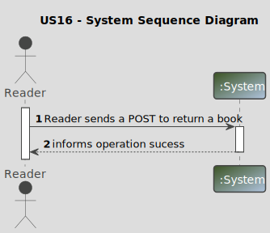
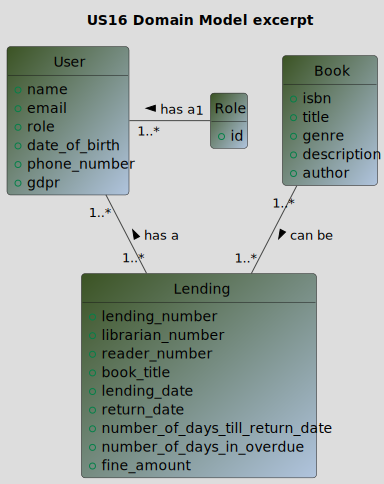
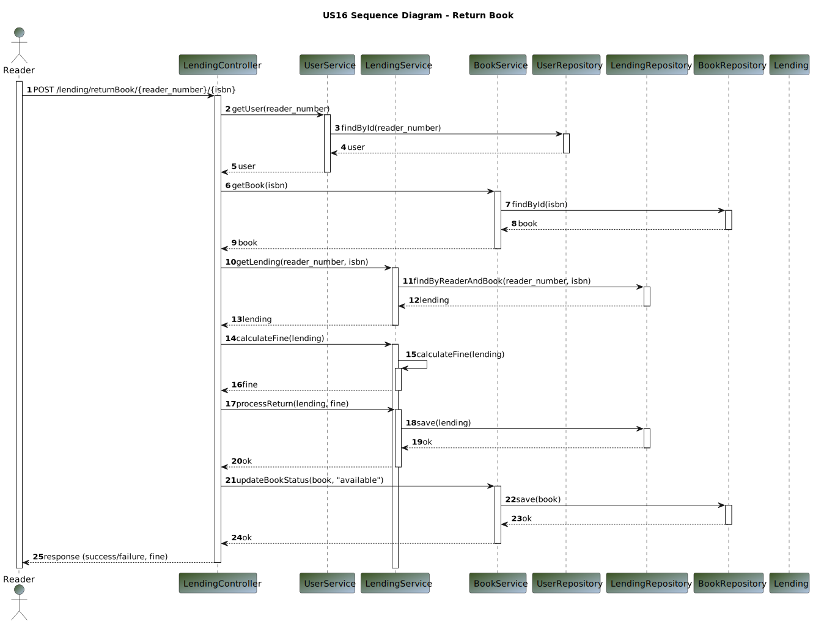
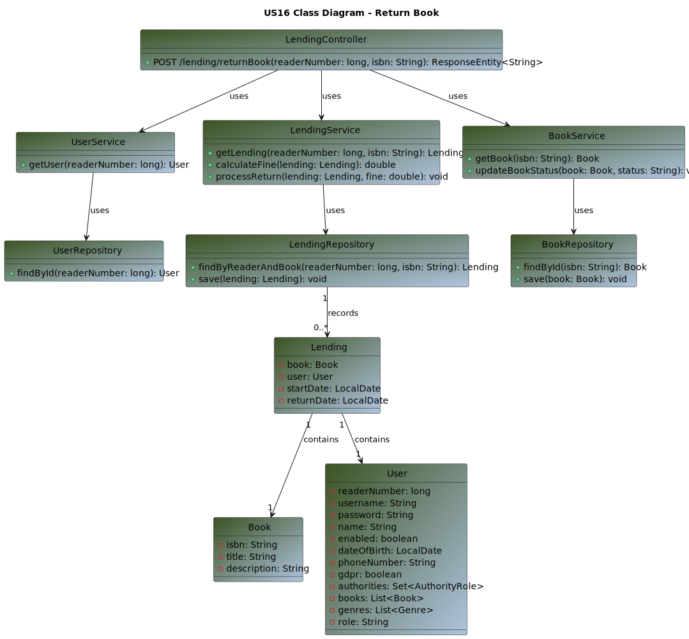

# US 16 - As Reader I want to return a book. If the return is overdue I’m fined by the library

## 1. Requirements Engineering

### 1.1. User Story Description

>As Reader I want to return a book. If the return is overdue I’m fined by the library

### 1.2. Customer Specifications and Clarifications

**From the specifications document:**

> By simplicity, a Reader wants to return a book, and if that return is overdue, a fine is applied.

**From the client clarifications:**

Question:
>1. Good afternoon,
-When a user wants to return a book, what information should the system ask for?
-Is the amount of the fine - and whether the return period has passed - calculated when the loan is consulted/refunded, or is it something to be calculated periodically?
-Is the value of the fine something to be persisted in the database? Of loans whose books were returned; or all, including open ones?
-Does the fine have a maximum value?
>2. Goodnight,
The question was whether the system asks the reader for the lending number or the isbn to identify the book to be returned. 
1.1 Is the comment related to the book, or to the loan?
>3. What is the maximum comment length?
>4. US says: As Reader I want to return a book. If the return is overdue I’m fined by the library.
If there is a 'fine' to be applied, should the system mark the book as returned anyway?
What should be recorded in the database in this case?
What should be shown to the user in case of a late return?

Answer:
>1. Good afternoon,
-the possibility of placing a comment/observations (optional) must be given
-this is an implementation decision. From a functional point of view, the important thing is that when you try to return the book, the amount of the fine is correct.
-Yes. it will later be handled by another part of the system to make the charge (out of scope)
-no
>2. Good morning
Both possibilities must exist
1.1 the comment is about the loan
>3. 1024 characters
>4. good morning,
If there is a 'fine' to be applied, should the system mark the book as returned anyway?
- Yes
What should be recorded in the database in this case?
- ignoring the fact that the customer does not know how to answer this question when asked in this way, the aim of this use case is to record that the book was returned, by whom, when, under what conditions and whether or not a fine was applied and of what value
What should be shown to the user in case of a late return?
- the amount of the fine
- 
### 1.3. Acceptance Criteria

**Ac16-01:** The commentary has maximum of 1024 characters

### 1.4. Found out Dependencies

>The library must have at least one registered reader and one book, in order to a librarian give the loan to the reader.

### 1.5 Input and Output Data

**Input Data:**

* Typed data:
    * book_title
    * lending_date
* Selected data:
    * reader_number
    * librarian_number

**Output Data:**

* (In)success of the operation

### 1.6. System Sequence Diagram (SSD)

### 1.7 Other Relevant Remarks

n/a

## 2. OO Analysis

### 2.1. Relevant Domain Model Excerpt

## 3. Design - User Story Realization

### 3.1. Sequence Diagram (SD)

### 3.2. Class Diagram (CD)

## 4. Tests

_n/a_

## 5. Observations

_n/a_

