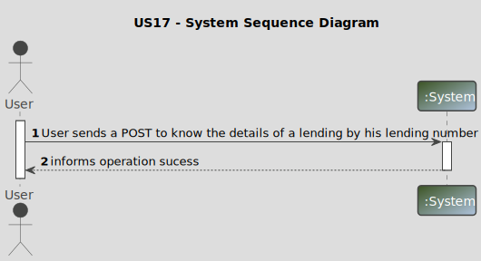
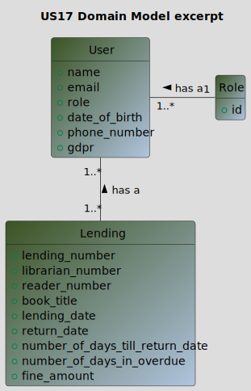
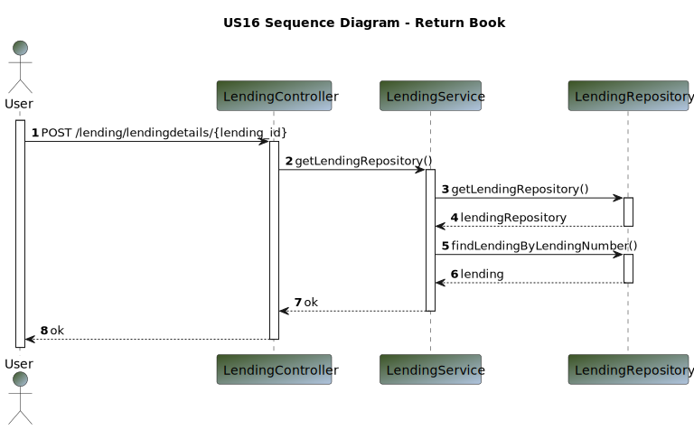
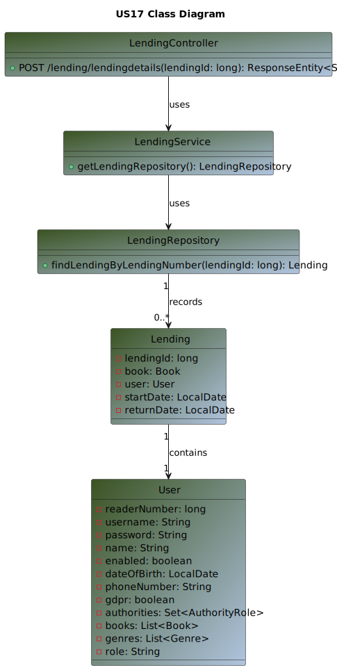

# US 17 - As Reader or Librarian I want to know the details of a lending given its lending number

## 1. Requirements Engineering

### 1.1. User Story Description

>As Reader or Librarian I want to know the details of a lending given its lending number

### 1.2. Customer Specifications and Clarifications

**From the specifications document:**

> By simplicity, a User wants to know the details of a lending, by his lending number.

**From the client clarifications:**

Question:
>1. Good morning. It must be possible for the reader and the librarian to access 
the details of a loan through its number.
Can you specify which details must be provided? Is there any difference in 
the details to be provided if a reader or a librarian requests it?
>2. Is the lending number a self-generated and self-incremented id?

Answer:
>1. good morning,
Both must be provided with:
lending number
book title
lending date
return date
number of days until return date (if applicable)
number of days in overdue (if applicable)
fine amount (if applicable)
>2. the lending number is a number created by the system and composed of the year of 
registration and a sequential number, e.g., 2023/1, 2024/19876

### 1.3. Acceptance Criteria

n/a

### 1.4. Found out Dependencies

>The library must have at least one lending.

### 1.5 Input and Output Data

**Input Data:**

* Typed data:
    * n/a
* Selected data:
    * lending_number

**Output Data:**

* (In)success of the operation

### 1.6. System Sequence Diagram (SSD)

### 1.7 Other Relevant Remarks

n/a

## 2. OO Analysis

### 2.1. Relevant Domain Model Excerpt

## 3. Design - User Story Realization

### 3.1. Sequence Diagram (SD)

### 3.2. Class Diagram (CD)

## 4. Tests

_n/a_

## 5. Observations

_n/a_

