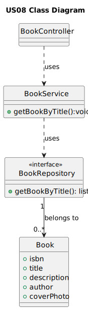

# 1. Requirements Engineering

## 1.1. User Story Description
    As Reader I want to search books by title

## 1.2. Customer Specifications and Clarifications

**Question**

    Good afternoon! I would like to know the acceptance criteria (Acceptance Criteria), for us7, us8, us9 and us10 of Books in phase 2.
**Answer**

    boa tarde,
    7. As Librarian, I want to register a book with a book cover photo
    this is a refinement of the existing use case. the user may choose to add a photo of the book cover. the photo must be in the jpeg or png format and at most 20 KB
    8. As Reader I want to search books by title
    ability to search by title entering the first letters of the title
    9. As Librarian I want to know the Top 5 books lent
    returns the list of the 5 books that have been lent the most in the last year. it must return for each book, the number of times the book has been lent. the result must be sorted descending order.
    10. As Librarian I want to know the Top 5 genres
    returns the 5 genres that the librarian possesses more books of. it must return the number of books per genre. the result must be sorted descending order

## 1.3. Acceptance Criteria

    Ability to search by title entering the first letters of the title

## 1.4. Found out Dependencies

    The library must have at least one book.

## 1.5 Input and Output Data
    Input data
        - Typed data:
            title
        -Selected data:
            n/a
    Output data
        books
        (In)Sucess of the operation
## 1.6. System Sequence Diagram (SSD)

## 1.7. Functionality
    The functionality of this user story is to allow the reader to search books by title.
## 1.8 Other Relevant Remarks
    n/a
# 2. OO Analysis
## 2.1. Relevant Domain Model Excerpt

## 2.2. Other Remarks
    n/a

# 3. Design
## 3.1. Sequence Diagram (SD)

## 3.2. Class Diagram (CD)

# 4. Tests
    n/a
# 5. Observations
    n/a

