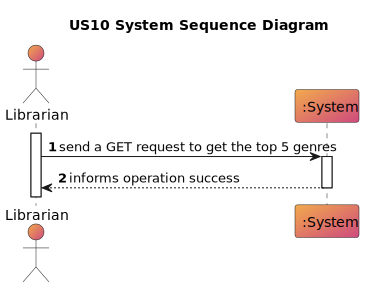
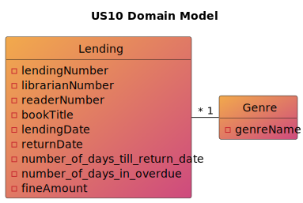
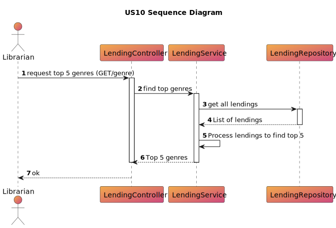

# US 10 -As Librarian I want to know the Top 5 genres

## 1. Requirements Engineering

### 1.1. User Story Description
>As a Librarian I want to know the Top 5 genres

### 1.2. Customer Specifications and Clarifications
> By simplicity, a Librarian  wants to know the Top 5 genre.

### 1.3. Acceptance Criteria
> AC10-01: The top 5 genres have to be the genres most read.

### 1.4. Found out Dependencies
> n/a

### 1.5 Input and Output Data

**Input Data:**

* n/a

**Output Data:**

* Top 5 genres
* (In)success of the operation

### 1.6. System Sequence Diagram (SSD)

# 2. OO Analysis
## 2.1. Relevant Domain Model Excerpt

## 2.2. Other Remarks
    n/a

# 3. Design
## 3.1. Sequence Diagram (SD)

# 4. Tests
    n/a
# 5. Observations

