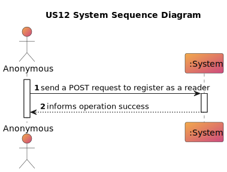
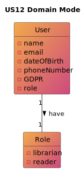
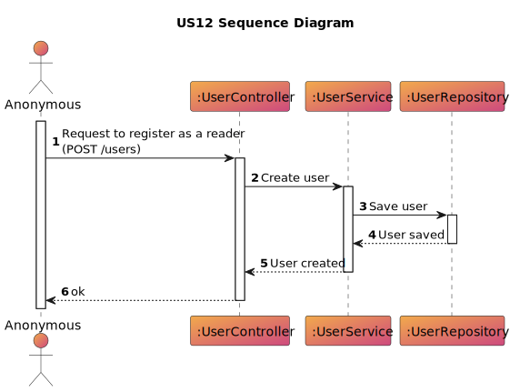

# US 12 - As anonymous I want to register as a reader with an optional photo, and optional list of interest

## 1. Requirements Engineering

### 1.1. User Story Description
>As anonymous I want to register as a reader with an optional photo, and optional list of interest

### 1.2. Customer Specifications and Clarifications
>  By simplicity, a reader has a name, a username, a date of birth, a phone number, a GDPR consent, a reader number.

### 1.3. Acceptance Criteria
    AC11-01: A reader can't have more than one email.
    AC11-02: A reader has to have atleast 12 years old.
    AC11-03: The phone number has to be portuguese.
    AC11-04: The reader number is formed by the year of the register and a sequential number.

### 1.4. Found out Dependencies
* n/a

### 1.5 Input and Output Data

**Input Data:**

* n/a

**Output Data:**

* (In)success of the operation

### 1.6. System Sequence Diagram (SSD)

# 2. OO Analysis
## 2.1. Relevant Domain Model Excerpt

## 2.2. Other Remarks
    n/a

# 3. Design
## 3.1. Sequence Diagram (SD)

# 4. Tests
    n/a
# 5. Observations

